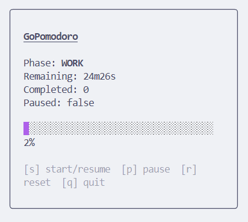
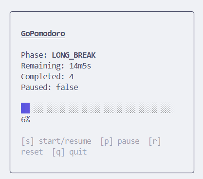

# GoPomodoro

A fast, minimal, cross‑platform **Pomodoro timer** for your terminal — built with **Go** and **Bubble Tea**.

---

## ✨ Features

* 🎯 **Pomodoro cycles**: Work / Short break / Long break
* ⏱ **Accurate timing** (deadline‑based with Go’s monotonic clock)
* 🖥 **TUI** built with Bubble Tea + Lip Gloss (keyboard‑first)
* 🔔 **System notifications** via `beeep`
* 💾 **Session count** (completed pomodoros during runtime)
* 🚀 **Single binary** (no external runtime, small footprint)

---

## 📸 Demo




---

## 📦 Installation

### Prerequisites

* **Go 1.24**

### From source

```bash
git clone https://github.com/ezchuang/GoPomodoro.git
cd GoPomodoro
go mod tidy
go build -o gopomodoro ./cmd/gopomodoro
./gopomodoro
```

### Go install

```bash
go install github.com/ezchuang/GoPomodoro/cmd/gopomodoro@latest
gopomodoro
```

> macOS users: allow notifications for your Terminal app in **System Settings → Notifications** if you want native alerts.

---

## 🛠 Usage

### Run with defaults

```bash
gopomodoro
# Work=25m, ShortBreak=5m, LongBreak=15m, LongBreakEvery=4
```

### Flags

```bash
gopomodoro \
  -work=45m \
  -short=10m \
  -long=20m \
  -long-every=3
```

* `-work`: work session duration (default `25m`)
* `-short`: short break duration (default `5m`)
* `-long`: long break duration (default `15m`)
* `-long-every`: take a long break every N completed work sessions (default `4`)

### Keybindings

* `s` → **Start/Resume**
* `p` → **Pause**
* `r` → **Reset/Stop**
* `q` / `Esc` / `Ctrl+C` → **Quit**

---

## 🧱 Project Structure

```
GoPomodoro/
├─ go.mod
├─ cmd/gopomodoro/main.go        # entrypoint / flags / wiring
├─ internal/core/engine.go       # PomodoroEngine (pure Go, deadline-based)
├─ internal/ui/tui.go            # Bubble Tea UI, keybindings, progress
└─ internal/notify/notifier.go   # system notifications via beeep
```

The core (`internal/core`) is decoupled from the UI, so you can reuse the engine for a future desktop app (Wails/Fyne) or expose an HTTP API.

---

## 📄 go.mod (example)

```go
module github.com/ezchuang/GoPomodoro

go 1.24.2

require (
	github.com/charmbracelet/bubbles v0.21.0
	github.com/charmbracelet/bubbletea v1.3.9
	github.com/charmbracelet/lipgloss v1.1.0
	github.com/gen2brain/beeep v0.11.1
)
```

Run `go mod tidy` after editing.

---

## 🧠 Design Notes

* **Deadline‑based timing**: compute remaining time as `EndsAt - Now()` to avoid drift from tick loops; survives sleep/wake.
* **Monotonic clock**: relies on Go’s monotonic time for stable scheduling.
* **Testability**: core abstracts a `Clock` interface, enabling fake clock in unit tests.
* **Non‑blocking notifications**: notifications are emitted via a callback on phase advancement.

---

## 🧩 Troubleshooting

### `missing go.sum entry for ... harmonica`

`bubbles/progress` depends on `github.com/charmbracelet/harmonica`. If your `go.sum` lacks that entry, run:

```bash
go mod tidy
# If still failing, align versions explicitly:
go get github.com/charmbracelet/bubbles@v0.21.0
go get github.com/charmbracelet/bubbletea@v0.26.6
go get github.com/charmbracelet/lipgloss@v0.10.0
go get github.com/gen2brain/beeep@latest
```

### Garbled UI / emoji width issues

Ensure your terminal uses a UTF‑8 font (e.g., a Nerd Font) and adequate column width.

### Notifications don’t show on macOS

Open **System Settings → Notifications**, and allow alerts for your Terminal app (or iTerm/WezTerm/etc.).

---

## 🗺 Roadmap

* [ ] Config file support at `$XDG_CONFIG_HOME/gopomodoro/config.yaml`
* [ ] Daily/weekly stats and persistence
* [ ] Optional sound alerts
* [ ] Export (CSV/JSON)
* [ ] HTTP API (REST + SSE) for external frontends/automation

---

## 🤝 Contributing

PRs and issues are welcome. Please keep the API small, add basic tests, and follow Go idioms.

---

## 📜 License

Apache-2.0 © 2025 [Ezra Chuang](https://github.com/ezchuang)

---

## 🙏 Acknowledgements

* [Charmbracelet](https://github.com/charmbracelet) ecosystem: Bubble Tea / Bubbles / Lip Gloss
* [`beeep`](https://github.com/gen2brain/beeep) for cross‑platform notifications
